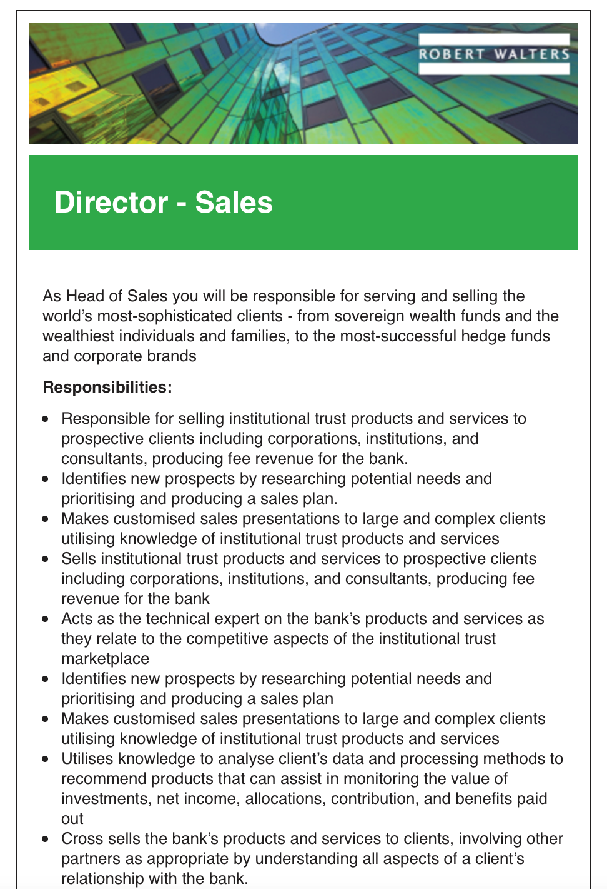
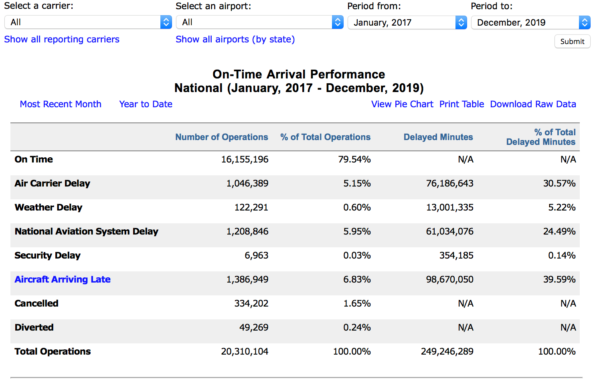

# RMIT Introduction to IT – Assignment 1
 
 

<h1>Personal Information:</h1>
 
<body>
Student name: Chris Lai

Student number:3866221

Email address: <a href="mailto:christopherhjlai@gmail.com">christopherhjlai@gmail.com</a>
</body>

<h2>Basic background:</h2>

<body>
Chris, originally from Taiwan and Portland, has been exposed to a multicultural environment and considers himself a global citizen. He is a trilingual speaker, fluent in Hokkien, Mandarin and English.

As a teenager, Chris devoted himself to the world of international relations and led his peers to engage in Model United Nations. He was involved in many causes and managed several conferences for more students to be part of this journey.

Having graduated from The University of Melbourne in Finance and Economics, Chris wishes to learn the basics of Information Technology as he understands that IT is part of our day-to-day living and that Financial sector is ever more intertwined with IT and the more knowledge you have, the better.
</body>

 
<h1>Interest in IT:</h1>
<body>
I have quite a few IT friends working in various sectors, I am surprised to see how flexible this profession can be and how rewarding it is to be able to solve many kinds of business operational issues in this profession. While I did not study IT nor have any experience in it, I always find it fascinating.
</body>

After graduated from
my Bachelor studies, I decided to be exposed to this mysterious field and give
it a go to see if I can pick up some basic knowledge and skills for me to
utilise for my finance or consulting career. As I am based in Melbourne and
frequently pass through the RMIT city campus to the University of Melbourne, I
decided that this reputable institution will be a great place to start my study
in IT. 

I hope to get the
bigger picture of what IT is, and IT is for. It may sound vague as I am very
foreign to this discipline, but once I understand the basic of IT, the interest
in this field will most certainly grow on me and benefits my career progress. 

 
<h1>Ideal Job:</h1>

The ideal job I think will suit me most is in sales. For example, the listing of Director of Sales for Robert Walters Australia. The link to this listing is <a href="https://www.seek.com.au/job/50098605?type=standard#searchRequestToken=d934f81a-f0f4-4585-b664-1c8a5d1424df">https://www.seek.com.au/job/50098605?type=standard#searchRequestToken=d934f81a-f0f4-4585-b664-1c8a5d1424df</a>.

I find this job to be very challenging as it requires the director to stay on top of current world affairs, market movements and governmental regulations. I admire those who can stay on top of the news and analyse underlying meanings of each news and movements at any given time. The reason why I am drawn to this job is precise because of love challenge and to be in an environment where you can explore more of the world you are not familiar with.

This job entails thorough knowledge of the financial products, the competitions, the related rules and regulations. As the director of sales, the person will also need to have the skill set to conduct extensive research, analyse data and come up with tailored sales pitch to potential clients. For analyse, often IT comes in to play and technicality terms can often be confusing and causing setbacks to the progress.

With my limited experience in finance, there is a long way ahead of me to be considered for this position. However, I can see that being able to work with a diverse team of people and an excellent sales skill are highly desirable, which I have some exposure during my job experience at the university recruiting offshore students. While I am not an expert on world affairs, I am always curious to learn about what is happening at the very moment and I have a habit of reading through the news on politics and international relations daily. Since I am now studying the basic of IT, I hope I will be able to understand some fundamental terminologies and to work along with IT counterparts to contribute my ideas fluently with them when analysing data and creating a compelling argument to my clients.

I believe once I have
been working in the financial industry, gain a decent knowledge of the certain
products from the company and expand my professional network, it will be a
great time for me to look for senior positions like this. When in a
professional networking event, I often advised by my superiors that many deals
happen through connection and small talks instead of flashy presentations. I
look forward to expanding my network while working in the industry and to build
a trusting relationship with my colleagues. 

 
<h1>Personal Profile:</h1>

My 16 Personalities test with Myers-Briggs Type Indicator (MBTI) test shows that I am a protagonist person with the results showing as <u>ENFJ-T</u>. A protagonist person is full of passion and charisma and can often be seen in politicians, coaches and teachers. This type of person is genuine, and unafraid to speak up when something needs to be said1. (Introduction to ENFJ-T personality, 16
Personalities)

I think this test
accurately reflect my personality and team playing skills. While I am a listener
in a team and is reliable to be trusted with tasks at hand, I can sometimes be
overly idealistic where conflict arises. Another weakness is that I can be too
sensitive when receiving criticism and thus take a downturn in my self-esteem2.
(ENFJ-T strengths and Weakness, 16 Personalities) This can potentially be
disastrous and turn the team into a dysfunctional one. In the future, I will
have to be aware of my personality and how it affects my team playing ability
to make sure the harmony and openness in a team remains. 

In terms of my
learning style, I am truly a <u>visual learner</u> who is best informed with
visualized diagram, pictures and to take notes during my studies. In order for
a piece of information to be memorable, I will need to take notes on a physical
paper and to use flashcards with a limited amount of information3. (Introduction
to Visual Learner, How-to-study.com) To utilise this information in the group
work environment, I will need to draw down a timeline and take notes of team
meeting minutes to memorize the discussion and decision made in the back of my
head. 

To better understand
what jobs I will be enjoying doing, I did an online
survey at JobOutlook by the Australian Government.
The result shows that I will be suitable for positions that require to
communicate with others and to work as a team. The recommended job such as
financial dealers, advertising and marketing professionals, ICT project
managers and sales and marketing managers4. (Job Outlook, Australian
Government)

This also echoes my
personality test that I am good with managing relationships and pitching ideas
to others.  I am an outgoing person who
enjoys constant communication with the public and I am sure those recommended
jobs will be suitable for my long-term career path. In relations to my ideal
job, the criteria’s matches perfectly, and I am more certain now after the
self-discovery and personal reflection that this correct direction I am heading
towards. 

 
<h1>Project Idea:</h1>

 
<h2>Overview of the project </h2>

The project will look
into how to enhance airline boarding efficiency and to avoid late passengers
who failed to arrive at the boarding gate prior to the gate close. My project
idea will be an integrated application that the gate agent can keep track on
where the checked-in passenger is located in the terminal and alert those who
potentially will be late for boarding. When boarding commences, passenger will
receive another pop-up alert on their phone when the person’s boarding group is
called so there won’t be a long queue in front of the gate. A smooth boarding
flow will make the embarkment process faster.

<h2>Motivation</h2>

When a particular
flight is delayed, not only is there a financial cost associated to it, but
also the loyalty from other passengers. There are many reasons to a delayed
flight, according to a recent statistic from U.S. Bureau of Transportation
statistics5, most common factor is aircraft arriving late from
previous service(s), followed by air carrier delay and national aviation system
delay.

A delay of 15 – 30
minutes may seem minor to the operation. However, according to Captain Martin
Gardiner from Qantas, the airline will be fined 20,000 pounds for each
non-compliance of time-slot at LHR (London Heathrow Airport)6. (O’Sullivan,
2015)

<h2>Description</h2>

This project entails a
mobile application that locate passengers once they have checked in for a
particular flight either online, in an application or in-person at the airport.
The tracking will only be limited within the terminal to avoid security or
privacy concern. If the gate agent deemed that a particular passenger cannot
arrive at the boarding gate for boarding, an alert or a phone call can be made
to the passenger. 

Another important
feature of this system is that those passengers with checked-in luggage will be
highlighted, in order to keep close monitor of their movement in the terminal.
The reason is because airline often because it will take a while for the
checked-in luggage to be identified in the cargo hold and the logistics to
unload the luggage can cause serious delay7. (Paris, 2017) 

In Australia, where
turnaround time between services is usually around 25 minutes, a delay of 15
minutes in the morning can cause ripple effect and disrupt the whole operation
network of the day for the airline. For example, the world’s second busiest air
route, Melbourne – Sydney, had a 25 % delay performance in February, 20188.
(Hatch, 2018) 

If the delay cause by
reckless passengers can be minimized by tracking and alerting passengers, this
will greatly enhance air traffic and soften the blow on airline’s financial
performance by avoiding hefty fines.

Another way to make
turnaround of an aircraft more efficient is to board passengers by group and
only those who has been called are allowed to be queueing at the boarding gate.
For instance, passengers can be seated at the gate lounge or sipping wine in
the lounge. Once the alert pops up at the passengers’ mobile app showing he or
she is next in line to board the plane and the estimated walking duration to
the gate lounge when make sure there are little queuing needed and makes the
passenger flow a breeze. 

The system will also
feature another important function, the lounge host can identify passengers who
is due to board the flight in the next 10 – 15 minutes in order for them to
monitor their movement. Often, we can hear cases where the passenger had too
much to drink and did not hear the announcement or checked the mobile. This can
help the ground operation to easily locate the passenger and allow a 10 – 15
minutes window period for necessary reminder. 

There is already
existing technology within the airline’s app to show the boarding time and when
the boarding commences. However, if the gate agent has the ability to locate
passengers and if the passengers will receive frequent reminders and
instructions to board the plane, it will decrease the chance of no-show hence
minimize a flight to be delayed. 

<h2>Tools &amp; Technologies</h2>

Since most airlines
already offers mobile app to navigate basic functions such as checking-in for a
flight, displaying mobile boarding pass and providing gate information, all we
need on the customer’s end is to allow GPS tracking while in the terminal,
allow pop-up alert to remind the passenger to board the plane. 

On the gate agents and
lounge hosts’ part, it will require a system to pull out targeted passengers’
location and offer different colour code or dot to identify passengers and
sending out alert to those passengers in risk to miss the flight. 

<h2>Skills required</h2>

In order to
successfully carry out this project, program engineers will need to add
additional functions to the existing mobile application and write a new system
for airline employees to track the passengers. 

Another critical skill
is for the airline employees to navigate the user surface to locate and alert
passengers when necessary. While most employees may not have any IT related
background, but the navigation should be fairly straight forward. 

If necessary, a trial
period can be conducted to enhance GPS efficiency and enhance logistics when
offering alerts. Another justifiable reason for the trial is for the passengers
to get used to the new and structured boarding process and showcase the
benefits of on-time flight performance, which will outweigh the slight privacy
concern of been tracked by the airline for the in-terminal movement.

<h2>Outcome</h2>

Once the trial ended,
the airline gate agents, lounge hosts and passengers will be familiar with the
new norm of boarding. If the passengers take on board with the reminders and
alerts sent out by the airline by arriving at the gate during the designated
time, there will be little human factors of late departure. This will
potentially have a tremendous positive impact on airline performance and to
retain customer loyalty as it will be deemed as a reliable airline to fly with.

 
<h1>References</h1>
 

1. Introduction to ENFJ-T personality, 16 Personalities Test. Available at <a href="https://www.16personalities.com/enfj-personality">https://www.16personalities.com/enfj-personality</a>. Retrieved on the 16th of June, 2020. 

 

2. ENFJ-T Strength and Weakness, 16 Personalities Test. Available at <a href="https://www.16personalities.com/enfj-strengths-and-weaknesses">https://www.16personalities.com/enfj-strengths-and-weaknesses</a>. Retrieved on the 16th of June, 2020. 

 

3. Introduction to Visual Learner, How-to-study.com. Available at <a href="https://www.how-to-study.com/study-skills-articles/visual-learner.asp">https://www.how-to-study.com/study-skills-articles/visual-learner.asp</a>. Retrieved on the 18th of June, 2020. 

 

4. Job Outlook, Australian Government. Available at <a href="https://joboutlook.gov.au/CareerQuizResult?search=quiz&amp;1=0&amp;2=1&amp;3=1&amp;4=5&amp;5=8&amp;6=0">https://joboutlook.gov.au/CareerQuizResult?search=quiz&amp;1=0&amp;2=1&amp;3=1&amp;4=5&amp;5=8&amp;6=0</a>.
Retrieved on the 18th of June, 2020. 

 

5. On-Time Arrival Performance National (January, 2017 – December, 2019). Available at <a href="https://www.transtats.bts.gov/OT_Delay/OT_DelayCause1.asp?pn=1">https://www.transtats.bts.gov/OT_Delay/OT_DelayCause1.asp?pn=1</a>. Retrieved on the 19th of June, 2020. 

 

6. Qantas risks large fines, losing slots at Heathrow for late A380s (M. O’Sullivan, 2015). Available at <a
href="https://www.smh.com.au/business/companies/qantas-risks-large-fines-losing-slots-at-heathrow-for-late-a380s-internal-memo-20150416-1mmciq.html">https://www.smh.com.au/business/companies/qantas-risks-large-fines-losing-slots-at-heathrow-for-late-a380s-internal-memo-20150416-1mmciq.html</a>. Retrieved on the 20th of June, 2020. 

 

7. Should airlines fine passengers who can’t get to the gate on time? (N. Paris, 2017). Available at <a
href="https://www.telegraph.co.uk/travel/news/passengers-late-boarding-gate-fined-airline-airport/">https://www.telegraph.co.uk/travel/news/passengers-late-boarding-gate-fined-airline-airport/</a>. Retrieved on the 20th of June, 2020. 

 

8. These are the worst flights in Australia for delays and cancellations. (P. Hatch, 2018). Available at <a
href="https://www.smh.com.au/business/companies/these-are-the-worst-flights-in-australia-for-delays-and-cancellations-20180427-p4zc3d.html">https://www.smh.com.au/business/companies/these-are-the-worst-flights-in-australia-for-delays-and-cancellations-20180427-p4zc3d.html</a>. Retrieved on the 21st of June, 2020. 

